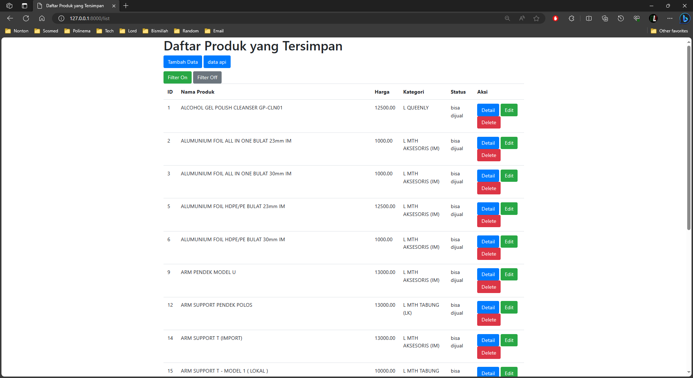
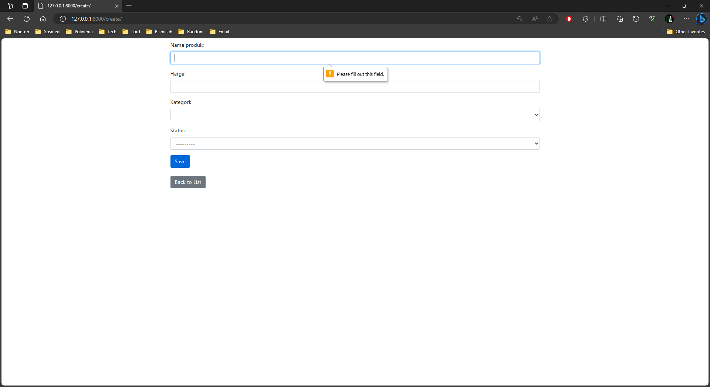
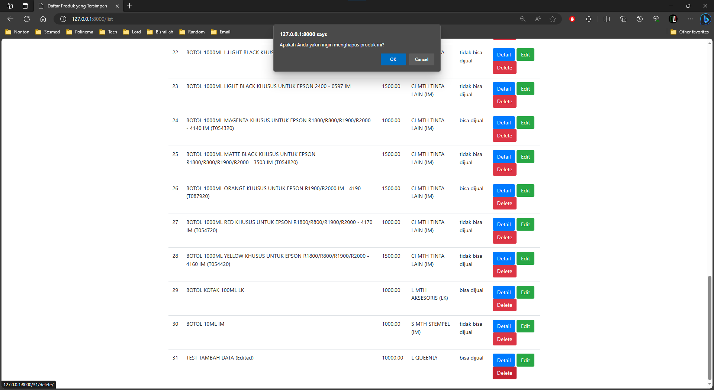

# Test Programmer

## Dokumentasi Program
Program ini dibuat menggunakan bahasa pemrograman python serta menggunakan framework django dengan memanfaatkan fitur Serializer dan untuk database, program ini menggunakan postgresql. berikut adalah dokumentasi program sesuai dengan soal yang telah diberikan.

***1. Ambil data dari API yang sudah disediakan.***
  
Gambar diatas merupakan data yang telah didapat dari API dan ditampilkan pada halaman utama. untuk menyimpan data api ke database. klik tombol `Simpan`. 
untuk melihat data yang telah tersimpan ke database, klik tombol "List data Tersimpan".

---

***2. Buat Database dengan table yang telah ditentukan.***
  
Gambar diatas merupakan gambar relasi tabel sesuai dengan tabel yang telah ditentukan.

---

***3. Simpan produk yang sudah anda dapatkan dari url produk***  
  
Gambar diatas merupakan tampilan "daftar produk yang Tersimpan" yang masih kosong karena data dari api belum disimpan kedalam database. untuk menyimpan data dari API ke dalam database, pertama masuk ke halaman utama dengan cara klik tombol "data api", kemudian dihalaman utama klik tombol "Simpan".  

---
***4. Buat halaman untuk menampilkan data yang sudah anda simpan***  
 
Gambar diatas merupakan tampilan "daftar produk yang Tersimpan" yang telah disimpan sebelumnya.

---
***5. Lalu tampilkan data yang hanya memiliki status " bisa dijual "***  
 
Gambar diatas merupakan tampilan "daftar produk yang Tersimpan" yang telah dilakukan filter untuk menampilkan status "bisa dijual" saja. untuk melakukan filter klik tombol "Filter On" dan untuk mengembalikannya klik tombol "Filter Off".

---
***6. Buat fitur untuk edit, tambah dan hapus***  
* Tambah data.  
(inputan nama harus diisi, dan harga harus berupa inputan angka)  
  
untuk melakukan tambah data klik tombol "Tambah Data" yang akan mengarah ke tampilan form tambah data.  
 
Gambar diatas merupakan tampilan "Form Tambah data" pada halaman ini form sudah menggunakan from validasi.  
  
Gambar diatas merupakan tampilan "Form Tambah data" ketika from input tidak diisi.  
  
Gambar diatas merupakan tampilan "daftar produk yang Tersimpan" yang telah dilakukan tambah data. 

* Edit data.  
  
untuk melakukan edit data klik tombol "edit" pada data yang ingin di edit. setelak di klik nanti akan mengarah pada form edit data.   
 
Gambar diatas merupakan tampilan "Form Edit data" pada halaman ini form sudah menggunakan from validasi sama seperti form tambah data.
  
Gambar diatas merupakan tampilan "daftar produk yang Tersimpan" yang telah dilakukan edit data.

* Hapus data.  
Untuk fitur hapus beri alert/konfirmasi(confirm) ketika di klik hapus  
 
Gambar diatas merupakan tampilan "hapus data" disaat tombol hapus di klik akan muncul konfirmasi untuk melanjutkan proses penghapusan data. klik "Ok" untuk meghapus data atau klik "Cancel" untuk membatalkan penghapusan data.
  
Gambar diatas merupakan tampilan "daftar produk yang Tersimpan" yang telah dilakukan penghapusan data.

---

***7. data telah berhasil tersimpan pada db postgresql***  
 

***(Muhammad Rizqi Mahendra)***

